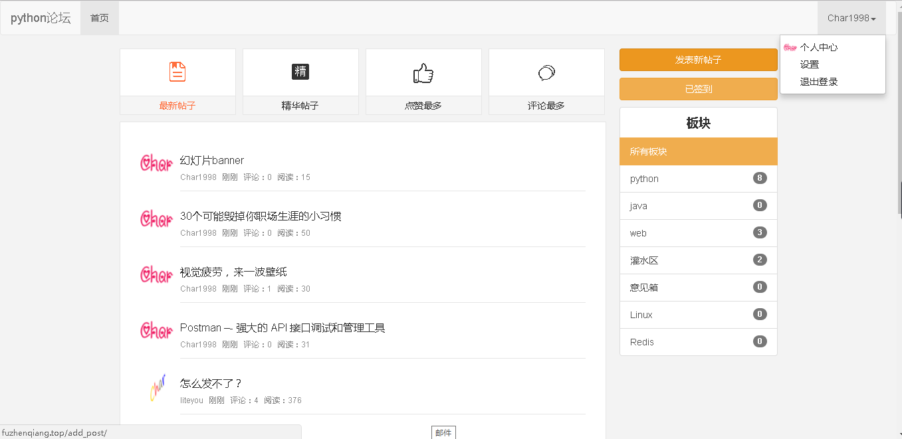

## 这是一个基于 Python27和Flask以及Bootstarp搭建的一个论坛项目

**项目演示地址**：[论坛demo](http://fuzhenqiang.top/)，欢迎注册使用并提供意见
**项目描述**：本项目分为两个部分，分为前台和CMS管理系统。

* 第一部分是前台页面，有用户系统，用户可以通过手机号码进行注册和登录，并且在登录和注册有验证码验证。用户登录后，达到一定积分后，可以发布帖子以及评论别人的帖子和回复别人的评论。在首页，用户可以对板块进行过滤和按时间、按评论量和按加精的方式进行排序。
* 第二部分是CMS管理系统。有用户系统，权限和分组。超级管理员分组中的用户拥有最高权限，普通管理员分组的用户只拥有简单的操作权限。CMS管理系统可以管理帖子、板块、评论、前台用户、CMS用户等。
* 此项目属于仅用于个人学习，禁止用于商业目的

下面是展示图：

​	首页的效果

登陆后的效果 

发布帖子的页面:

然后`cms`页面

就不一一列举了，这个论坛暂时v1版本就这样了，目前在忙着博客，v2.0估计还要很久。而且最近在准备找实习，哈哈就这样吧